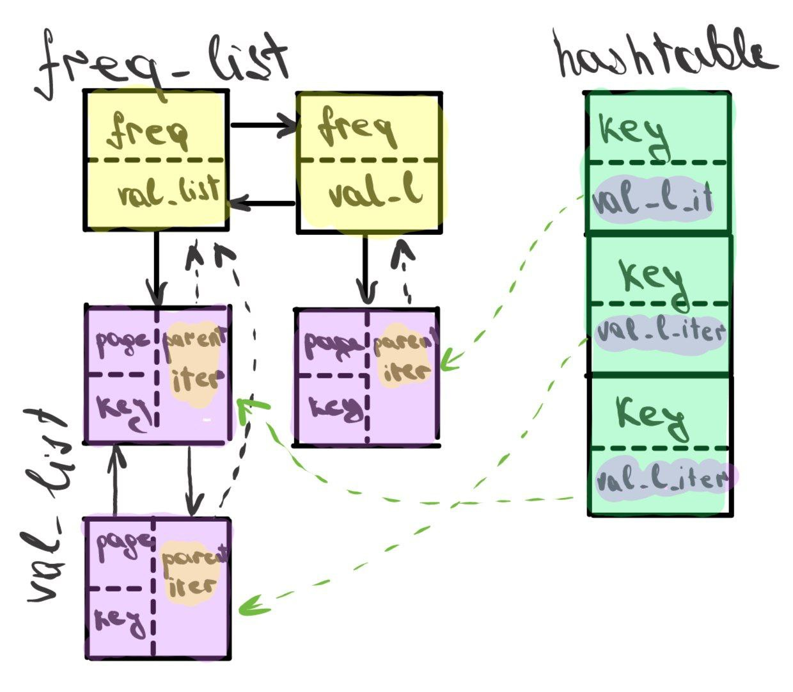
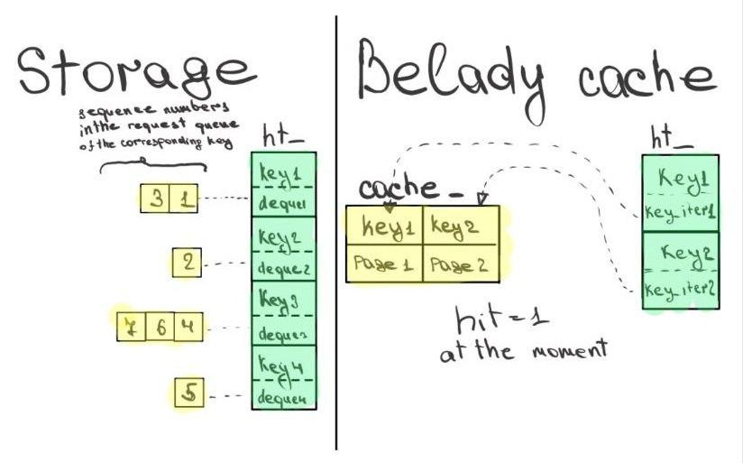

# LFU-cache

## About
Here is my LFU-cache implementation with complexity:
    - removing **O(1)**;
    - insertion **O(1)**;
    - search **O(1)**.
and Belady-cache implementation with complexity:
    - removing **O(1)**;
    - insertion **O(1)**;
    - search **O(m)**, where m is the cache capacity.


## LFU-cache

### Structure


The class is wrapped in the 'caches' namespace.

### Methods

The function `lookup_update()` allows you to save new elements to the cache. If the 'key' is already used in the cache, the function returns 'true', otherwize 'false'.
The function `full()` checks if the cache is full.

## Belady-cache

### About
This is a cache based on one of the optimal caching algorithms, which, however, is not used in practice, since implementation requires knowing the entire sequence of requests in advance. In reality, the future is unknown to us :). 
The idea of the algorithm is simple:
1) If referred page is already present, increment hit count.
2) If not present, find if a page that is never referenced in future. If such a page exists, replace this page with new page. If no such page exists, find a page that is referenced farthest in future. Replace this page with new page.
In the case when it is necessary to displace some element from the filled cache, I check how many times in the sequence of requests the key that has come now occurs. If 1 time, then I skip it.

### Structure


When constructing an belady cache, we first bypass the entire sequence of requests and create a "Storage", as a result of which the time complexity of finding an element to displace will decrease from **O(m*n)** to **O(m)**, where m is the cache capacity and n is the number of requests.

The class is wrapped in the 'belady_caches' namespace.

### Methods

The function `lookup_update()` allows you to save new elements to the cache. If the 'key' is already used in the cache, the function returns 'true', otherwize 'false'.
The function `full()` checks if the cache is full.

## Build

For compile this project, type:
```bash
git clone https://github.com/Waloid24/LFU-cache.git
cd LFU-cache/
```
If you want **to create and run tests**, type:
```bash
cd testing/
./tester.sh <number_of_tests>
```
You will find the created tests in the folder *./tests*.
Нou will find the number of lfu-cache hits in *./result/lfu_cache*, and the number of belady-cache hits in *./result/belady_cache*

If you want **to create a graph** of the ratio of hits of these caches, type:

```bash
cd testing/
./graph_builder.sh <number_of_tests>
```
You can find the resulting graph in *../images* folder.

**NOTE!** If you are running tests or plotting for the first time, then do not pay attention to the following error:
```
rm: cannot remove 'result/lfu_cache': No such file or directory
rm: cannot remove 'result/belady_cache': No such file or directory
```

If you just want to compile and run the project, type:
```bash
cmake . -B ./build
cmake --build ./build
```
to build and compile the project.

To start the lfu-cache, type:
```bash
cd build/
./lfu_cache
```
and enter the cache capacity and the sequence of requests in the form: <capacity> <number of requests> <requests>.
For example:
```bash
4 12 1 2 3 4 1 2 5 1 2 4 3 4
```
where the first digit is the capacity, the second digit is the number of requests, the rest are the requests themselves.

To start the belady-cache, type:
```bash
cd build/
./belady_cache
```
The rest is similar.

It is also possible to run Google tests for lfu-cache using:
```bash
cd ./build
./lfu_cache_testing
```
This is my first work with Google tests, please be lenient in criticism, but be sure to criticize!


